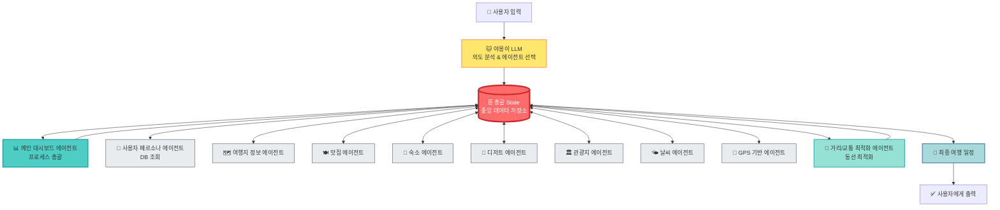

# 🗺️ 여행 플래너 멀티 에이전트 시스템 개발 가이드

## 📋 목차
1. [시스템 개요](#시스템-개요)
2. [전체 아키텍처](#전체-아키텍처)
3. [총괄 State 스키마](#총괄-state-스키마)
4. [에이전트 목록 및 역할](#에이전트-목록-및-역할)
5. [에이전트 개발 규칙](#에이전트-개발-규칙)
6. [에이전트 간 통신 프로토콜](#에이전트-간-통신-프로토콜)
7. [개발 시작하기](#개발-시작하기)

---

## 시스템 개요

### 🎯 목적
사용자가 자연어로 여행 계획을 요청하면, LLM이 의도를 파악하고 필요한 에이전트들을 동적으로 선택하여 **최적화된 여행 일정을 자동으로 생성**하는 멀티 에이전트 시스템

### 💡 핵심 특징
- **자연어 입력**: "부산 3박 4일 여행 가고 싶어, 해산물 좋아해" → 자동으로 일정 생성
- **멀티 에이전트 협업**: 각 에이전트가 전문 분야의 데이터를 수집하고 공유
- **동적 라우팅**: LLM이 사용자 요청을 분석하여 필요한 에이전트만 실행
- **최적화**: 거리, 교통, 시간을 고려한 최적 동선 생성
- **실시간 정보**: 날씨, GPS 기반 실시간 정보 반영

### 🔄 워크플로우
```
사용자 입력 
    ↓
야옹이 LLM (의도 파악 및 에이전트 선택)
    ↓
    ┌─────────────────────────────────────┐
    │      총괄 State (중앙 저장소)        │
    │  - 모든 에이전트가 읽고 쓰는 공유 상태  │
    │  - 사용자 정보, 수집 데이터, 일정 등   │
    └─────────────────────────────────────┘
         ↕                    ↕
메인 대시보드 에이전트 (총괄 조정)
         ↕
    ┌────┴────┐
    │ 총괄 State │ ← 모든 에이전트가 State를 통해 데이터 공유
    └────┬────┘
         ↕
[병렬 실행] 필요한 전문 에이전트들
    ├─ 사용자 페르소나 에이전트 (DB에서 사용자 선호도 조회) ↔ State
    ├─ 여행지 정보 에이전트 ↔ State
    ├─ 맛집 에이전트 ↔ State
    ├─ 숙소 에이전트 ↔ State
    ├─ 디저트 에이전트 ↔ State
    ├─ 관광지 에이전트 ↔ State
    ├─ 날씨 에이전트 ↔ State
    └─ GPS 기반 에이전트 ↔ State
         ↕
    ┌────┴────┐
    │ 총괄 State │ ← 모든 데이터가 여기 모임
    └────┬────┘
         ↕
거리/교통 최적화 에이전트 (동선 최적화) ↔ State
         ↕
    ┌────┴────┐
    │ 총괄 State │ ← 최종 일정 저장
    └────┬────┘
         ↓
최종 여행 일정 생성 및 출력
```

---

## 전체 아키텍처



### 🔑 핵심 개념

**총괄 State = 중앙 데이터 저장소**
- 모든 에이전트는 State를 **읽고(Read)** **쓰기(Write)** 합니다
- 에이전트끼리 직접 통신하지 않고, **State를 통해서만** 데이터를 주고받습니다
- State는 **단일 진실 공급원(Single Source of Truth)** 역할을 합니다

---

## 총괄 State 스키마

> ⚠️ **중요**: 모든 에이전트는 이 State 스키마를 **반드시** 따라야 합니다.

### State 구조

```python
from typing import TypedDict, List, Dict, Optional, Annotated
from datetime import datetime
import operator

class TravelPlannerState(TypedDict):
    """총괄 State - 모든 에이전트가 공유하는 중앙 상태"""
    
    # ==================== 사용자 입력 & 대화 ====================
    user_input: str  # 사용자의 원본 입력 (예: "부산 3박4일 여행")
    conversation_history: Annotated[List[Dict], operator.add]  # 대화 히스토리
    # 예시: [{"role": "assistant", "content": "어디 가고 싶으세요?"}, {"role": "user", "content": "부산"}]
    
    parsed_intent: Optional[Dict]  # LLM이 파싱한 의도
    
    # 사용자에게 물어볼 정보 관리
    required_info: List[str]  # 필요한 정보 목록 (예: ["destination", "dates", "budget"])
    collected_info: List[str]  # 이미 수집된 정보 목록
    pending_question: Optional[str]  # 사용자에게 물어볼 다음 질문
    is_info_complete: bool  # 필요한 정보를 모두 수집했는지 여부
    
    # ==================== 사용자 정보 ====================
    user_id: Optional[str]  # 회원 ID (DB 조회용)
    user_persona: Optional[Dict]  # DB에서 가져온 사용자 여행 페르소나
    # 예시: {"travel_style": "힐링", "food_preference": ["한식", "해산물"], "budget_level": "중상"}
    
    # ==================== 여행 기본 정보 ====================
    destination: Optional[str]  # 여행지 (예: "부산")
    start_date: Optional[str]  # 시작일 (YYYY-MM-DD)
    end_date: Optional[str]  # 종료일 (YYYY-MM-DD)
    num_days: Optional[int]  # 여행 일수
    num_travelers: Optional[int]  # 여행 인원
    budget: Optional[int]  # 총 예산 (원)
    
    # 사용자 선호도 (대화를 통해 수집)
    food_preferences: Optional[List[str]]  # 음식 선호도 (예: ["한식", "해산물", "디저트"])
    accommodation_preference: Optional[str]  # 숙소 선호 (예: "호텔", "게스트하우스")
    travel_style: Optional[str]  # 여행 스타일 (예: "힐링", "액티비티", "맛집투어")
    activity_level: Optional[str]  # 활동 강도 (예: "여유", "보통", "빡빡")
    special_requests: Optional[List[str]]  # 특별 요청사항
    
    # ==================== 에이전트 라우팅 ====================
    selected_agents: Annotated[List[str], operator.add]  # LLM이 선택한 에이전트 목록
    completed_agents: Annotated[List[str], operator.add]  # 완료된 에이전트 목록
    next_agent: Optional[str]  # 다음 실행할 에이전트
    
    # ==================== 각 에이전트 수집 데이터 ====================
    destination_info: Optional[Dict]  # 여행지 상세 정보
    restaurants: Annotated[List[Dict], operator.add]  # 맛집 목록
    accommodations: Annotated[List[Dict], operator.add]  # 숙소 목록
    desserts: Annotated[List[Dict], operator.add]  # 디저트/카페 목록
    landmarks: Annotated[List[Dict], operator.add]  # 관광지 목록
    weather_info: Optional[Dict]  # 날씨 정보
    gps_data: Optional[Dict]  # GPS 기반 위치 데이터
    
    # ==================== 최적화 데이터 ====================
    optimized_routes: Annotated[List[Dict], operator.add]  # 최적화된 동선
    transport_info: Annotated[List[Dict], operator.add]  # 교통 정보
    
    # ==================== 최종 일정 ====================
    itinerary: Annotated[List[Dict], operator.add]  # 최종 여행 일정
    # 예시: [{"day": 1, "time": "09:00", "activity": "호텔 체크인", "place": "해운대 호텔", ...}, ...]
    
    total_cost: Optional[int]  # 총 예상 비용
    
    # ==================== 에이전트 간 통신 ====================
    messages: Annotated[List[Dict], operator.add]  # 에이전트 간 메시지
    # 예시: {"from": "restaurant_agent", "to": "optimization_agent", "data": {...}}
    
    # ==================== 시스템 상태 ====================
    current_step: str  # 현재 진행 단계
    errors: Annotated[List[str], operator.add]  # 에러 로그
    is_complete: bool  # 전체 프로세스 완료 여부
```

### 데이터 모델 상세

#### 1. 맛집 데이터 (`restaurants`)
```python
{
    # 기본 정보
    "id": "rest_001",
    "name": "해운대 바다횟집",
    "category": "한식",  # 한식, 중식, 일식, 양식, 아시안, 퓨전, 카페, 디저트 등
    "sub_category": ["해산물", "회", "해물탕"],  # 세부 카테고리
    "cuisine_type": "seafood",  # korean, chinese, japanese, western, asian, fusion
    
    # 위치 정보
    "address": "부산광역시 해운대구 중동 1234-5",
    "district": "해운대구",  # 구/군
    "area": "해운대",  # 세부 지역
    "latitude": 35.1587,
    "longitude": 129.1603,
    "nearby_landmark": "해운대 해수욕장",  # 주변 랜드마크
    "distance_from_station": 500,  # 역/정류장으로부터 거리 (m)
    
    # 평가 정보
    "rating": 4.5,  # 평점 (5점 만점)
    "review_count": 1234,
    "naver_rating": 4.6,
    "google_rating": 4.4,
    "kakao_rating": 4.5,
    "michelin_guide": False,  # 미슐랭 가이드 등재 여부
    "awards": [],  # 수상 내역
    
    # 가격 정보
    "price_range": "30000-50000",  # 1인 평균 가격대
    "price_level": 3,  # 1(저렴) ~ 5(고가)
    "average_price_per_person": 40000,
    "payment_methods": ["카드", "현금", "계좌이체"],
    "valet_parking": False,
    
    # 메뉴 정보
    "signature_menu": [
        {"name": "모둠회", "price": 50000, "description": "신선한 제철 회 모둠"},
        {"name": "해물탕", "price": 35000, "description": "푸짐한 해물이 가득"}
    ],
    "menu_categories": ["회", "구이", "탕", "찜"],
    "vegetarian_options": False,  # 채식 옵션 여부
    "halal": False,  # 할랄 인증
    
    # 운영 정보
    "opening_hours": {
        "monday": "11:00-22:00",
        "tuesday": "11:00-22:00",
        "wednesday": "11:00-22:00",
        "thursday": "11:00-22:00",
        "friday": "11:00-23:00",
        "saturday": "11:00-23:00",
        "sunday": "11:00-22:00"
    },
    "break_time": "15:00-17:00",  # 브레이크 타임
    "last_order": "21:30",  # 라스트 오더
    "closed_days": ["매월 첫째주 월요일"],  # 정기 휴무
    "reservation_required": True,  # 예약 필수 여부
    "reservation_url": "https://...",
    "waiting_time_avg": 30,  # 평균 대기 시간 (분)
    
    # 편의시설
    "parking": True,
    "parking_fee": "무료",
    "wifi": True,
    "pet_friendly": False,
    "kids_friendly": True,
    "wheelchair_accessible": True,
    "private_room": True,  # 룸 여부
    "outdoor_seating": False,
    
    # 분위기 & 특징
    "atmosphere": ["가족 모임", "데이트", "회식"],  # 적합한 분위기
    "view": "오션뷰",  # 뷰 (오션뷰, 시티뷰, 마운틴뷰 등)
    "noise_level": "보통",  # 조용함, 보통, 시끄러움
    "dress_code": "캐주얼",
    
    # 연락처 & SNS
    "phone": "051-123-4567",
    "website": "https://...",
    "instagram": "@restaurant_name",
    "blog_url": "https://blog.naver.com/...",
    
    # 리뷰 키워드 (AI 분석)
    "positive_keywords": ["신선함", "푸짐함", "친절함", "뷰가 좋음"],
    "negative_keywords": ["대기 시간", "주차 어려움"],
    "best_time_to_visit": "평일 점심",  # 방문 추천 시간
    
    # 추가 정보
    "description": "해운대 해변이 보이는 신선한 해산물 전문점. 현지인과 관광객 모두에게 인기.",
    "images": [
        "https://image1.jpg",
        "https://image2.jpg"
    ],
    "tags": ["해산물", "오션뷰", "데이트", "가족외식", "현지맛집"],
    "popularity_score": 85,  # 인기도 점수 (0-100)
    "tourist_friendly": True,  # 관광객 친화적
    "english_menu": True,  # 영어 메뉴판
    "recommended_by_locals": True,  # 현지인 추천
    "featured_in_media": ["맛있는 녀석들", "생생정보통"],  # 방송 출연
    
    # 계절/시간대별 추천
    "best_season": ["봄", "여름", "가을"],
    "best_meal_time": "저녁",  # 아침, 점심, 저녁
    
    # 예약 & 혼잡도
    "reservation_difficulty": "높음",  # 낮음, 보통, 높음
    "peak_hours": ["12:00-13:00", "18:00-20:00"],
    "estimated_dining_time": 90,  # 예상 식사 시간 (분)
}
```

#### 2. 숙소 데이터 (`accommodations`)
```python
{
    # 기본 정보
    "id": "hotel_001",
    "name": "해운대 그랜드 호텔",
    "type": "호텔",  # 호텔, 리조트, 펜션, 게스트하우스, 모텔, 한옥, 글램핑, 에어비앤비
    "star_rating": 5,  # 별점 (1-5성급)
    "brand": "그랜드 호텔 체인",  # 브랜드/체인
    
    # 위치 정보
    "address": "부산광역시 해운대구 우동 1234-5",
    "district": "해운대구",
    "area": "해운대",
    "latitude": 35.1587,
    "longitude": 129.1603,
    "distance_to_beach": 100,  # 해변까지 거리 (m)
    "distance_to_station": 500,  # 역까지 거리 (m)
    "nearby_attractions": ["해운대 해수욕장", "동백섬", "누리마루"],
    
    # 평가 정보
    "rating": 4.7,
    "review_count": 890,
    "naver_rating": 4.8,
    "google_rating": 4.6,
    "booking_rating": 9.2,  # 부킹닷컴 평점 (10점 만점)
    "agoda_rating": 8.9,
    
    # 가격 정보
    "price_per_night": 150000,  # 1박 기준 (최저가)
    "price_range": "150000-500000",  # 객실 타입별 가격대
    "weekend_surcharge": 20000,  # 주말 추가 요금
    "peak_season_price": 200000,  # 성수기 가격
    "discount_available": True,  # 할인 가능 여부
    "long_stay_discount": True,  # 장기 숙박 할인
    
    # 객실 정보
    "room_types": [
        {
            "type": "스탠다드 더블",
            "size": 33,  # 평수
            "capacity": 2,
            "bed_type": "더블",
            "price": 150000,
            "view": "시티뷰",
            "amenities": ["TV", "에어컨", "냉장고", "커피머신"]
        },
        {
            "type": "디럭스 오션뷰",
            "size": 45,
            "capacity": 3,
            "bed_type": "킹",
            "price": 250000,
            "view": "오션뷰",
            "amenities": ["TV", "에어컨", "냉장고", "커피머신", "욕조", "발코니"]
        }
    ],
    "total_rooms": 200,  # 총 객실 수
    
    # 체크인/아웃
    "check_in": "15:00",
    "check_out": "11:00",
    "early_check_in": True,  # 얼리 체크인 가능
    "late_check_out": True,  # 레이트 체크아웃 가능
    "check_in_method": ["프론트 데스크", "모바일 체크인"],
    
    # 편의시설 & 서비스
    "amenities": [
        "무료 WiFi",
        "수영장",
        "피트니스 센터",
        "스파",
        "사우나",
        "비즈니스 센터",
        "레스토랑",
        "카페",
        "바",
        "룸서비스",
        "발레파킹",
        "컨시어지",
        "세탁 서비스",
        "키즈 클럽"
    ],
    "breakfast_included": True,
    "breakfast_type": "뷔페",  # 뷔페, 세트, 미포함
    "breakfast_price": 25000,  # 조식 가격 (별도인 경우)
    "breakfast_time": "07:00-10:00",
    
    # 주차
    "parking": True,
    "parking_type": "실내 주차장",
    "parking_fee": "무료",  # 무료, 유료, 발레파킹
    "parking_spaces": 150,
    
    # 정책
    "pet_friendly": False,
    "smoking_allowed": False,  # 흡연 가능 여부
    "smoking_rooms_available": True,  # 흡연 객실 여부
    "children_policy": "12세 이하 무료",
    "extra_bed_available": True,
    "extra_bed_fee": 30000,
    "cancellation_policy": "체크인 3일 전까지 무료 취소",
    
    # 접근성
    "wheelchair_accessible": True,
    "elevator": True,
    "accessible_rooms": 10,  # 장애인 객실 수
    
    # 연락처
    "phone": "051-234-5678",
    "email": "info@grandhotel.com",
    "website": "https://www.grandhotel.com",
    "reservation_phone": "1588-1234",
    
    # 특징 & 분위기
    "atmosphere": ["럭셔리", "비즈니스", "가족 여행"],
    "view_types": ["오션뷰", "시티뷰", "마운틴뷰"],
    "best_for": ["신혼여행", "가족여행", "비즈니스"],
    
    # 주변 정보
    "nearby_restaurants": 50,  # 반경 500m 내 음식점 수
    "nearby_convenience_stores": 3,
    "public_transport": ["지하철 2호선 해운대역 도보 5분", "버스 정류장 도보 2분"],
    
    # 리뷰 키워드
    "positive_keywords": ["청결함", "친절함", "뷰가 좋음", "위치 좋음", "조식 맛있음"],
    "negative_keywords": ["가격이 비쌈", "주차장 혼잡"],
    
    # 추가 정보
    "description": "해운대 해변이 한눈에 보이는 5성급 호텔. 최고급 시설과 서비스 제공.",
    "images": [
        "https://hotel-exterior.jpg",
        "https://room-oceanview.jpg",
        "https://pool.jpg"
    ],
    "tags": ["오션뷰", "럭셔리", "수영장", "조식맛집", "가족여행"],
    "popularity_score": 92,
    "awards": ["2024 트립어드바이저 우수상", "베스트 오션뷰 호텔"],
    
    # 예약 정보
    "booking_platforms": ["네이버", "야놀자", "여기어때", "부킹닷컴", "아고다"],
    "instant_booking": True,  # 즉시 예약 가능
    "availability_status": "예약 가능",  # 예약 가능, 거의 만실, 만실
    "popular_dates": ["주말", "공휴일", "여름 성수기"],
    
    # 계절별 추천
    "best_season": ["여름", "가을"],
    "peak_season": "7월-8월",
}
```

#### 3. 디저트/카페 데이터 (`desserts`)
```python
{
    # 기본 정보
    "id": "cafe_001",
    "name": "바다뷰 카페",
    "type": "카페",  # 카페, 베이커리, 디저트 전문점, 아이스크림, 티하우스
    "specialty": "브런치 & 디저트",
    
    # 위치 정보
    "address": "부산광역시 해운대구 우동 5678",
    "district": "해운대구",
    "area": "해운대",
    "latitude": 35.1590,
    "longitude": 129.1605,
    "floor": 3,  # 층수
    "nearby_landmark": "해운대 해수욕장",
    
    # 평가 정보
    "rating": 4.6,
    "review_count": 2345,
    "instagram_followers": 15000,  # 인스타 팔로워
    "instagram_posts": 3500,  # 인스타 게시물 수
    
    # 가격 정보
    "price_range": "5000-15000",
    "average_price": 10000,
    "price_level": 2,  # 1(저렴) ~ 5(고가)
    
    # 메뉴 정보
    "signature_menu": [
        {"name": "시그니처 크로플", "price": 12000, "description": "바삭한 크로플에 아이스크림"},
        {"name": "오션뷰 브런치", "price": 18000, "description": "푸짐한 브런치 세트"}
    ],
    "menu_categories": ["커피", "음료", "디저트", "브런치", "베이커리"],
    "coffee_bean": "원두 직접 로스팅",
    "vegan_options": True,
    "gluten_free_options": True,
    
    # 운영 정보
    "opening_hours": {
        "monday": "10:00-22:00",
        "tuesday": "10:00-22:00",
        "wednesday": "10:00-22:00",
        "thursday": "10:00-22:00",
        "friday": "10:00-23:00",
        "saturday": "09:00-23:00",
        "sunday": "09:00-22:00"
    },
    "break_time": None,
    "waiting_time_avg": 20,  # 평균 대기 시간
    "reservation": False,  # 예약 가능 여부
    
    # 편의시설
    "parking": True,
    "parking_fee": "2시간 무료",
    "wifi": True,
    "wifi_password": "고객에게 제공",
    "power_outlets": True,  # 콘센트
    "pet_friendly": True,
    "kids_friendly": True,
    "wheelchair_accessible": True,
    "outdoor_seating": True,
    "rooftop": True,  # 루프탑
    "terrace": True,
    
    # 분위기 & 특징
    "atmosphere": ["인스타그램", "데이트", "브런치", "작업하기 좋음"],
    "view": "오션뷰",
    "interior_style": "모던 미니멀",
    "noise_level": "보통",
    "seating_capacity": 80,  # 좌석 수
    "private_rooms": False,
    "photo_spots": ["루프탑", "창가 좌석", "인테리어 소품"],  # 사진 명소
    
    # 연락처 & SNS
    "phone": "051-345-6789",
    "instagram": "@oceanview_cafe",
    "instagram_hashtags": ["#해운대카페", "#오션뷰카페", "#부산카페"],
    "blog_reviews": 450,  # 블로그 리뷰 수
    
    # 리뷰 키워드
    "positive_keywords": ["뷰가 좋음", "인스타감성", "디저트 맛있음", "분위기 좋음"],
    "negative_keywords": ["대기 시간", "가격이 비쌈", "시끄러움"],
    "best_time_to_visit": "평일 오후",
    
    # 추가 정보
    "description": "해운대 바다가 한눈에 보이는 루프탑 카페. 인스타그램 핫플.",
    "images": [
        "https://cafe-exterior.jpg",
        "https://oceanview.jpg",
        "https://dessert.jpg"
    ],
    "tags": ["오션뷰", "루프탑", "인스타핫플", "브런치맛집", "디저트맛집"],
    "popularity_score": 88,
    "featured_in_media": ["인스타그램 핫플 100선"],
    
    # 방문 추천
    "best_season": ["봄", "여름", "가을"],
    "best_time_of_day": "일몰 시간",  # 방문 추천 시간대
    "recommended_duration": 90,  # 추천 체류 시간 (분)
    "instagram_worthy": True,  # 인스타그램 감성
    "sunset_view": True,  # 일몰 뷰
}
```

#### 4. 관광지 데이터 (`landmarks`)
```python
{
    # 기본 정보
    "id": "landmark_001",
    "name": "해동용궁사",
    "type": "문화재",  # 문화재, 자연, 박물관, 테마파크, 전망대, 해변, 공원, 시장 등
    "category": "사찰",
    "sub_category": ["불교 사찰", "해안 사찰"],
    
    # 위치 정보
    "address": "부산광역시 기장군 기장읍 용궁길 86",
    "district": "기장군",
    "area": "기장",
    "latitude": 35.1884,
    "longitude": 129.2233,
    "altitude": 50,  # 해발 고도 (m)
    
    # 평가 정보
    "rating": 4.6,
    "review_count": 5678,
    "naver_rating": 4.7,
    "google_rating": 4.5,
    "tripadvisor_rating": 4.5,
    "tripadvisor_rank": 5,  # 부산 관광지 중 순위
    
    # 입장 정보
    "entrance_fee": 0,  # 무료
    "entrance_fee_detail": {
        "adult": 0,
        "teenager": 0,
        "child": 0,
        "senior": 0
    },
    "ticket_types": [],  # 무료이므로 없음
    "online_booking": False,
    "fast_pass": False,
    
    # 운영 정보
    "opening_hours": {
        "weekday": "04:00-19:00",
        "weekend": "04:00-19:00"
    },
    "closed_days": [],  # 연중무휴
    "best_visiting_time": "일출 시간",  # 방문 추천 시간
    "recommended_duration": 90,  # 추천 관람 시간 (분)
    "peak_hours": ["09:00-11:00", "14:00-16:00"],
    "off_peak_hours": ["04:00-07:00", "17:00-19:00"],
    
    # 편의시설
    "parking": True,
    "parking_fee": "무료",
    "parking_spaces": 100,
    "restroom": True,
    "restaurant": False,
    "cafe": True,
    "gift_shop": True,
    "locker": False,
    "wheelchair_accessible": "부분 가능",  # 전체 가능, 부분 가능, 불가능
    "stroller_friendly": False,
    "elevator": False,
    "audio_guide": False,
    
    # 특징 & 볼거리
    "highlights": [
        "해수관음상",
        "용궁단",
        "108계단",
        "일출 명소",
        "바다 전망"
    ],
    "photo_spots": ["해수관음상", "108계단", "바다 전망대"],
    "activities": ["사진 촬영", "기도", "산책", "일출 감상"],
    
    # 접근성
    "public_transport": [
        "버스 181번 해동용궁사 정류장 하차",
        "지하철 해운대역에서 버스 환승"
    ],
    "distance_from_city_center": 15,  # km
    "travel_time_from_city_center": 40,  # 분
    "accessible_by_car": True,
    "accessible_by_public_transport": True,
    
    # 주변 정보
    "nearby_attractions": [
        {"name": "기장 해안산책로", "distance": 500},
        {"name": "죽성성당", "distance": 2000}
    ],
    "nearby_restaurants": 10,
    "nearby_cafes": 5,
    
    # 리뷰 키워드
    "positive_keywords": ["경치 좋음", "일출 명소", "사진 명소", "평화로움"],
    "negative_keywords": ["계단 많음", "주차 어려움(성수기)"],
    
    # 추가 정보
    "description": "바다 위에 세워진 아름다운 사찰. 일출 명소로 유명하며 108계단을 내려가면 바다와 맞닿은 용궁단이 있음.",
    "history": "1376년 공민왕의 왕사였던 나옹화상이 창건",
    "cultural_significance": "부산 대표 해안 사찰",
    "images": [
        "https://temple-overview.jpg",
        "https://sunrise.jpg",
        "https://stairs.jpg"
    ],
    "tags": ["사찰", "일출명소", "바다뷰", "사진명소", "힐링"],
    "popularity_score": 90,
    
    # 계절/시간별 추천
    "best_season": ["봄", "가을"],
    "best_weather": "맑음",
    "avoid_weather": "비, 태풍",
    "seasonal_events": [
        {"season": "봄", "event": "벚꽃 축제"},
        {"season": "겨울", "event": "일출 기도"}
    ],
    
    # 방문 팁
    "tips": [
        "일출을 보려면 새벽 일찍 방문 권장",
        "계단이 많아 편한 신발 착용 필수",
        "성수기에는 주차가 어려우니 대중교통 이용 권장",
        "사찰이므로 조용히 관람"
    ],
    "dress_code": "단정한 복장",
    "photography_allowed": True,
    "drone_allowed": False,
    
    # 난이도 (체력 소모)
    "difficulty_level": "중",  # 쉬움, 중, 어려움
    "physical_demand": "계단 많음",
    "suitable_for": ["성인", "청소년", "어린이(보호자 동반)"],
    "not_suitable_for": ["거동 불편자", "유모차"],
    
    # 가이드 투어
    "guided_tour_available": False,
    "audio_guide_languages": [],
    
    # 특별 정보
    "unesco_heritage": False,
    "national_treasure": False,
    "cultural_property": True,
    "awards": ["한국 관광 100선"],
}
```

#### 5. 최종 일정 데이터 (`itinerary`)
```python
{
    # 기본 정보
    "id": "itinerary_day1_001",
    "day": 1,
    "date": "2024-12-01",
    "day_of_week": "금요일",
    "time": "09:00",
    "end_time": "09:30",  # 종료 시간
    
    # 활동 정보
    "activity_type": "accommodation",  # restaurant, dessert, landmark, transport, free_time, shopping
    "activity_name": "호텔 체크인",
    "place_id": "hotel_001",  # 해당 장소의 ID (restaurants, accommodations 등에서 참조)
    "place_name": "해운대 그랜드 호텔",
    "place_category": "호텔",
    
    # 위치 정보
    "address": "부산광역시 해운대구 우동 1234-5",
    "district": "해운대구",
    "latitude": 35.1587,
    "longitude": 129.1603,
    
    # 시간 정보
    "duration": 30,  # 활동 소요 시간 (분)
    "recommended_arrival_time": "08:50",  # 권장 도착 시간
    "flexible": False,  # 시간 조정 가능 여부
    
    # 비용 정보
    "cost": 150000,  # 예상 비용
    "cost_type": "숙박비",  # 식비, 입장료, 교통비, 숙박비, 쇼핑 등
    "payment_method": "카드",
    "included_in_package": False,  # 패키지에 포함 여부
    
    # 교통 정보 (이전 장소로부터)
    "transport_from_previous": {
        "method": "택시",  # 도보, 버스, 지하철, 택시, 렌터카, 자전거
        "distance": 15000,  # 거리 (m)
        "duration": 30,  # 소요 시간 (분)
        "cost": 20000,  # 교통비
        "route": "부산역 → 해운대역 → 호텔",
        "details": "택시 이용 시 약 30분 소요",
        "alternative_routes": [
            {
                "method": "지하철",
                "duration": 45,
                "cost": 1500,
                "details": "부산역 → 해운대역 하차 후 도보 5분"
            }
        ]
    },
    
    # 다음 장소로의 교통 정보
    "transport_to_next": {
        "method": "도보",
        "distance": 500,
        "duration": 10,
        "cost": 0,
        "route": "호텔 → 해운대 해수욕장"
    },
    
    # 활동 상세
    "description": "호텔 체크인 및 짐 정리. 객실에서 오션뷰 감상.",
    "notes": "체크인 시간이 15:00이므로 얼리 체크인 가능 여부 사전 확인 필요",
    "tips": [
        "짐을 맡기고 먼저 관광 가능",
        "호텔 조식 시간 확인",
        "주차 쿠폰 받기"
    ],
    "warnings": [],  # 주의사항
    
    # 예약 정보
    "reservation_required": True,
    "reservation_status": "완료",  # 완료, 필요, 불필요
    "reservation_confirmation": "RES-12345",
    "reservation_url": "https://...",
    "contact_phone": "051-234-5678",
    
    # 날씨 고려
    "weather_dependent": False,  # 날씨 영향 여부
    "indoor_outdoor": "indoor",  # indoor, outdoor, both
    "alternative_if_rain": None,  # 비 올 때 대체 활동
    
    # 동행자 고려
    "suitable_for_kids": True,
    "suitable_for_elderly": True,
    "suitable_for_disabled": True,
    "group_size_limit": None,  # 인원 제한
    
    # 우선순위 & 유연성
    "priority": "high",  # high, medium, low (일정 조정 시 우선순위)
    "skippable": False,  # 생략 가능 여부
    "must_do": True,  # 필수 활동 여부
    
    # 연관 정보
    "related_activities": [],  # 연관 활동 ID
    "conflicts_with": [],  # 충돌하는 활동 ID
    
    # 사진/추억
    "photo_opportunity": True,
    "photo_spots": ["객실 오션뷰", "로비"],
    
    # 준비물
    "items_needed": ["신분증", "예약 확인서"],
    
    # 체력 소모
    "energy_level": "low",  # low, medium, high (체력 소모 정도)
    
    # 태그
    "tags": ["숙박", "체크인", "휴식"],
    
    # 최적화 정보
    "optimization_score": 95,  # 일정 최적화 점수 (0-100)
    "route_efficiency": "최적",  # 최적, 양호, 개선 필요
}
```

---

## 에이전트 목록 및 역할

### 1️⃣ 야옹이 LLM (Intent Analyzer & Conversation Agent)
**역할**: 사용자 입력을 분석하고, 부족한 정보를 대화를 통해 수집하여 필요한 에이전트 선택

**입력**:
- `user_input`: 사용자의 자연어 입력
- `conversation_history`: 이전 대화 내역

**출력**:
- `parsed_intent`: 파싱된 의도 (목적지, 날짜, 예산 등)
- `required_info`: 필요한 정보 목록
- `collected_info`: 수집된 정보 목록
- `pending_question`: 다음 질문 (정보가 부족한 경우)
- `is_info_complete`: 정보 수집 완료 여부
- `selected_agents`: 실행할 에이전트 목록 (정보가 충분한 경우)
- `conversation_history`: 업데이트된 대화 내역

**대화 흐름 예시**:

```
👤 사용자: "여행 가고 싶어"

🐱 야옹이: "좋아요! 어디로 여행 가고 싶으세요?"
[State 업데이트: required_info = ["destination", "dates", "budget", "preferences"]]

👤 사용자: "부산"

🐱 야옹이: "부산 좋네요! 언제 가실 계획이세요? (예: 12월 1일부터 3박 4일)"
[State 업데이트: destination = "부산", collected_info = ["destination"]]

👤 사용자: "다음주 금요일부터 3박4일"

🐱 야옹이: "알겠습니다! 예산은 얼마 정도 생각하고 계세요?"
[State 업데이트: start_date = "2024-12-06", num_days = 3, collected_info = ["destination", "dates"]]

👤 사용자: "100만원 정도"

🐱 야옹이: "좋아요! 마지막으로 몇 가지만 더 여쭤볼게요.
1. 어떤 음식을 좋아하세요? (예: 한식, 일식, 해산물 등)
2. 숙소는 어떤 스타일을 선호하세요? (호텔, 게스트하우스, 리조트 등)
3. 여행 스타일은? (힐링/여유, 액티비티/빡빡, 맛집투어 등)"

👤 사용자: "해산물 좋아하고, 호텔이 좋고, 여유롭게 다니고 싶어"

🐱 야옹이: "완벽해요! 부산 3박4일 여행 일정을 만들어드릴게요 🎉
- 목적지: 부산
- 기간: 12/6(금) ~ 12/9(월), 3박 4일
- 예산: 100만원
- 음식: 해산물
- 숙소: 호텔
- 스타일: 힐링/여유

잠시만 기다려주세요, 최고의 일정을 만들고 있어요!"

[State 업데이트: 
  is_info_complete = True,
  selected_agents = ["user_persona", "destination", "restaurant", "accommodation", 
                     "dessert", "landmark", "weather", "gps", "optimization"]
]
```

**질문 템플릿**:

```python
QUESTION_TEMPLATES = {
    "destination": [
        "어디로 여행 가고 싶으세요?",
        "여행지를 알려주세요!",
        "어느 도시로 떠나고 싶으세요?"
    ],
    "dates": [
        "언제 가실 계획이세요? (예: 12월 1일부터 3박 4일)",
        "여행 날짜를 알려주세요!",
        "출발일과 여행 기간을 알려주세요."
    ],
    "budget": [
        "예산은 얼마 정도 생각하고 계세요?",
        "여행 예산을 알려주세요! (1인 기준 또는 총 예산)",
        "대략적인 예산 범위를 알려주시겠어요?"
    ],
    "food_preferences": [
        "어떤 음식을 좋아하세요? (예: 한식, 일식, 해산물, 디저트 등)",
        "선호하는 음식 종류가 있나요?",
        "먹고 싶은 음식이 있으신가요?"
    ],
    "accommodation": [
        "숙소는 어떤 스타일을 선호하세요? (호텔, 게스트하우스, 리조트 등)",
        "어떤 숙소에서 묵고 싶으세요?",
        "숙소 선호도를 알려주세요!"
    ],
    "travel_style": [
        "여행 스타일은 어떤 걸 선호하세요? (힐링, 액티비티, 맛집투어, 문화탐방 등)",
        "어떤 여행을 원하시나요?",
        "여행에서 가장 중요하게 생각하는 건 무엇인가요?"
    ],
    "activity_level": [
        "일정을 얼마나 빡빡하게 짜드릴까요? (여유롭게, 보통, 빡빡하게)",
        "하루에 몇 군데 정도 방문하고 싶으세요?",
        "활동적인 여행과 느긋한 여행 중 어떤 걸 선호하세요?"
    ]
}
```

**정보 수집 로직**:

```python
def intent_analyzer_agent(state: TravelPlannerState) -> TravelPlannerState:
    """야옹이 LLM - 의도 분석 및 대화형 정보 수집"""
    
    # 1. 사용자 입력에서 정보 추출
    user_input = state["user_input"]
    extracted_info = extract_info_from_input(user_input)  # LLM으로 파싱
    
    # 2. 필요한 정보 목록 정의
    required_info = ["destination", "dates", "budget", "food_preferences", 
                     "accommodation", "travel_style"]
    
    # 3. 이미 수집된 정보 확인
    collected = []
    if state.get("destination"): collected.append("destination")
    if state.get("start_date"): collected.append("dates")
    if state.get("budget"): collected.append("budget")
    if state.get("food_preferences"): collected.append("food_preferences")
    if state.get("accommodation_preference"): collected.append("accommodation")
    if state.get("travel_style"): collected.append("travel_style")
    
    # 4. 부족한 정보 확인
    missing_info = [info for info in required_info if info not in collected]
    
    # 5. 정보가 부족하면 질문 생성
    if missing_info:
        next_question = generate_question(missing_info[0])  # 첫 번째 부족한 정보에 대해 질문
        
        return {
            **state,
            "required_info": required_info,
            "collected_info": collected,
            "pending_question": next_question,
            "is_info_complete": False,
            "conversation_history": [{
                "role": "assistant",
                "content": next_question,
                "timestamp": datetime.now().isoformat()
            }],
            "next_agent": "wait_for_user"  # 사용자 응답 대기
        }
    
    # 6. 정보가 충분하면 에이전트 선택
    else:
        selected_agents = select_agents_based_on_intent(state)
        
        return {
            **state,
            "is_info_complete": True,
            "selected_agents": selected_agents,
            "conversation_history": [{
                "role": "assistant",
                "content": f"완벽해요! {state['destination']} 여행 일정을 만들어드릴게요 🎉",
                "timestamp": datetime.now().isoformat()
            }],
            "next_agent": "dashboard"  # 대시보드로 이동
        }
```

**에이전트 선택 로직**:

```python
def select_agents_based_on_intent(state: TravelPlannerState) -> List[str]:
    """사용자 의도에 따라 필요한 에이전트 선택"""
    
    agents = ["user_persona", "destination", "weather", "gps"]  # 기본 에이전트
    
    # 음식 선호도가 있으면 맛집 에이전트 추가
    if state.get("food_preferences"):
        agents.append("restaurant")
        if "디저트" in state["food_preferences"] or "카페" in state["food_preferences"]:
            agents.append("dessert")
    
    # 숙소 정보 필요
    if state.get("num_days", 0) > 0:
        agents.append("accommodation")
    
    # 여행 스타일에 따라 관광지 에이전트 추가
    if state.get("travel_style") in ["문화탐방", "액티비티", "힐링"]:
        agents.append("landmark")
    
    # 항상 최적화 에이전트는 마지막에
    agents.append("optimization")
    
    return agents
```

---

### 2️⃣ 메인 대시보드 에이전트 (Main Dashboard Agent)
**역할**: 전체 프로세스 조정 및 에이전트 실행 순서 관리

**책임**:
- 에이전트 실행 순서 결정
- 에이전트 간 데이터 흐름 관리
- 에러 핸들링 및 재시도
- 진행 상황 모니터링

**출력**:
- `next_agent`: 다음 실행할 에이전트
- `current_step`: 현재 진행 단계

---

### 3️⃣ 사용자 페르소나 에이전트 (User Persona Agent)
**역할**: DB에서 사용자의 여행 페르소나 조회

**입력**:
- `user_id`: 회원 ID

**출력**:
- `user_persona`: 사용자 여행 스타일, 선호도 등

**DB 스키마 예시**:
```python
{
    "user_id": "user123",
    "travel_style": "힐링",  # 힐링, 액티비티, 문화탐방, 맛집투어 등
    "food_preference": ["한식", "해산물", "디저트"],
    "accommodation_preference": "호텔",  # 호텔, 게스트하우스, 리조트
    "budget_level": "중상",  # 저, 중하, 중, 중상, 상
    "activity_level": "보통",  # 여유, 보통, 빡빡
    "past_destinations": ["제주", "강릉"]
}
```

---

### 4️⃣ 여행지 정보 에이전트 (Destination Agent)
**역할**: 여행지에 대한 상세 정보 제공

**입력**:
- `destination`: 여행지 이름

**출력**:
- `destination_info`: 여행지 개요, 특징, 추천 지역 등

**예시**:
```python
{
    "name": "부산",
    "description": "대한민국 제2의 도시, 해양 관광 도시",
    "popular_areas": ["해운대", "광안리", "남포동", "기장"],
    "best_season": ["봄", "가을"],
    "famous_for": ["해변", "해산물", "야경", "사찰"],
    "average_temperature": 15,  # 해당 시즌 평균 기온
    "recommended_days": 3  # 추천 여행 일수
}
```

---

### 5️⃣ 맛집 에이전트 (Restaurant Agent)
**역할**: 여행지의 맛집 정보 수집 및 추천

**입력**:
- `destination`: 여행지
- `user_persona.food_preference`: 음식 선호도
- `budget`: 예산

**출력**:
- `restaurants`: 맛집 목록 (위 데이터 모델 참조)

**API 사용**:
- Naver Place API
- Kakao Local API
- Google Places API

**추천 로직**:
- 평점 4.0 이상
- 리뷰 수 100개 이상
- 사용자 선호도 매칭
- 예산 범위 내

---

### 6️⃣ 숙소 에이전트 (Accommodation Agent)
**역할**: 숙소 검색 및 추천

**입력**:
- `destination`: 여행지
- `start_date`, `end_date`: 체크인/아웃 날짜
- `num_travelers`: 인원
- `budget`: 예산
- `user_persona.accommodation_preference`: 숙소 선호도

**출력**:
- `accommodations`: 숙소 목록

**API 사용**:
- 야놀자 API
- 여기어때 API
- Airbnb API

---

### 7️⃣ 디저트 에이전트 (Dessert Agent)
**역할**: 카페 및 디저트 가게 추천

**입력**:
- `destination`: 여행지
- `user_persona`: 사용자 선호도

**출력**:
- `desserts`: 카페/디저트 목록

**특징**:
- 인스타그램 핫플 우선
- 시그니처 메뉴 정보 포함

---

### 8️⃣ 관광지 에이전트 (Landmark Agent)
**역할**: 관광지 및 액티비티 추천

**입력**:
- `destination`: 여행지
- `user_persona.travel_style`: 여행 스타일
- `num_days`: 여행 일수

**출력**:
- `landmarks`: 관광지 목록

**카테고리**:
- 자연 (해변, 산, 공원)
- 문화재 (사찰, 박물관, 역사 유적)
- 액티비티 (테마파크, 체험)
- 야경 명소

---

### 9️⃣ 날씨 에이전트 (Weather Agent)
**역할**: 여행 기간 날씨 정보 제공

**입력**:
- `destination`: 여행지
- `start_date`, `end_date`: 여행 날짜

**출력**:
- `weather_info`: 날씨 정보

**API 사용**:
- OpenWeatherMap API
- 기상청 API

**예시**:
```python
{
    "forecast": [
        {"date": "2024-12-01", "temp_max": 15, "temp_min": 8, "condition": "맑음", "precipitation": 0},
        {"date": "2024-12-02", "temp_max": 14, "temp_min": 7, "condition": "흐림", "precipitation": 20}
    ],
    "recommendations": ["가벼운 외투 필요", "우산 준비"]
}
```

---

### 🔟 GPS 기반 에이전트 (GPS Agent)
**역할**: 위치 기반 실시간 정보 제공

**입력**:
- `destination`: 여행지
- `landmarks`, `restaurants`, `desserts`, `accommodations`: 수집된 장소들

**출력**:
- `gps_data`: 각 장소의 정확한 위도/경도

**기능**:
- 주소 → 좌표 변환 (Geocoding)
- 좌표 검증
- 거리 계산 기초 데이터 제공

**API 사용**:
- Kakao Maps API
- Google Maps Geocoding API

---

### 1️⃣1️⃣ 거리/교통 최적화 에이전트 (Optimization Agent)
**역할**: 최적 동선 및 교통 수단 추천

**입력**:
- 모든 에이전트가 수집한 장소 데이터
- `user_persona.activity_level`: 활동 강도

**출력**:
- `optimized_routes`: 일자별 최적 동선
- `transport_info`: 교통 수단 및 소요 시간
- `itinerary`: 최종 일정

**최적화 알고리즘**:
1. **TSP (Traveling Salesman Problem)** 기반 동선 최적화
2. **시간대별 배치**:
   - 09:00-12:00: 관광지
   - 12:00-14:00: 점심 (맛집)
   - 14:00-17:00: 관광지/액티비티
   - 17:00-18:00: 카페/디저트
   - 18:00-20:00: 저녁 (맛집)
   - 20:00-22:00: 야경/자유시간
3. **교통 수단 선택**:
   - 500m 이내: 도보
   - 2km 이내: 택시/버스
   - 2km 이상: 지하철/버스

**API 사용**:
- Kakao Mobility API (길찾기)
- Google Maps Directions API
- 대중교통 API

---

## 에이전트 개발 규칙

### ✅ 필수 규칙

#### 1. 함수 시그니처
모든 에이전트는 다음 시그니처를 따라야 합니다:

```python
def your_agent(state: TravelPlannerState) -> TravelPlannerState:
    """에이전트 설명"""
    # 로직 구현
    return updated_state
```

#### 2. State 업데이트 규칙
- ✅ **자신의 담당 필드만 업데이트**
- ✅ **List 필드는 추가만 가능** (`operator.add` 사용)
- ✅ **다른 에이전트 데이터는 읽기만 가능**
- ❌ **다른 에이전트 데이터 삭제/수정 금지**

```python
# ✅ 올바른 예시
def restaurant_agent(state: TravelPlannerState) -> TravelPlannerState:
    new_restaurants = search_restaurants(state["destination"])
    
    return {
        **state,
        "restaurants": new_restaurants,  # 자신의 필드만 업데이트
        "completed_agents": ["restaurant_agent"]
    }

# ❌ 잘못된 예시
def restaurant_agent(state: TravelPlannerState) -> TravelPlannerState:
    state["landmarks"] = []  # 다른 에이전트 데이터 수정 금지!
    return state
```

#### 3. 에러 처리
모든 에이전트는 try-except로 에러를 처리해야 합니다:

```python
def your_agent(state: TravelPlannerState) -> TravelPlannerState:
    try:
        # 로직 구현
        result = do_something()
        
        return {
            **state,
            "your_field": result,
            "completed_agents": ["your_agent"]
        }
    except Exception as e:
        return {
            **state,
            "errors": [f"[your_agent] {str(e)}"],
            "completed_agents": ["your_agent"]  # 실패해도 완료 표시
        }
```

#### 4. 로깅
중요한 작업은 `messages`에 기록:

```python
return {
    **state,
    "restaurants": results,
    "messages": [{
        "from": "restaurant_agent",
        "timestamp": datetime.now().isoformat(),
        "content": f"{len(results)}개의 맛집을 찾았습니다.",
        "data": {"count": len(results)}
    }]
}
```

---

## 에이전트 간 통신 프로토콜

### 메시지 형식

```python
{
    "from": "sender_agent",  # 발신 에이전트
    "to": "receiver_agent",  # 수신 에이전트 (optional, None이면 전체)
    "timestamp": "2024-12-01T10:30:00",
    "message_type": "request",  # request, response, info, error
    "content": "메시지 내용",
    "data": {  # 추가 데이터
        "key": "value"
    }
}
```

### 통신 예시

#### 예시 1: 최적화 에이전트가 맛집 에이전트에게 추가 정보 요청
```python
# 최적화 에이전트
return {
    **state,
    "messages": [{
        "from": "optimization_agent",
        "to": "restaurant_agent",
        "message_type": "request",
        "content": "해운대 지역 맛집만 필터링 필요",
        "data": {"area": "해운대"}
    }]
}
```

#### 예시 2: 날씨 에이전트가 전체 에이전트에게 정보 공유
```python
# 날씨 에이전트
return {
    **state,
    "weather_info": weather_data,
    "messages": [{
        "from": "weather_agent",
        "to": None,  # 전체 공유
        "message_type": "info",
        "content": "12월 2일 비 예보, 실내 활동 권장",
        "data": {"rainy_dates": ["2024-12-02"]}
    }]
}
```

---

## 개발 시작하기

### Step 1: 개발 환경 설정

```bash
# 가상환경 생성
python -m venv venv
source venv/bin/activate  # Windows: venv\Scripts\activate

# 필수 패키지 설치
pip install langgraph langchain openai python-dotenv requests
```

### Step 2: State 스키마 임포트

```python
from state_schema import TravelPlannerState
```

### Step 3: 에이전트 개발 템플릿

```python
def your_agent(state: TravelPlannerState) -> TravelPlannerState:
    """
    [에이전트 이름] 에이전트
    
    역할: [에이전트 역할 설명]
    
    입력:
    - state["field1"]: 설명
    - state["field2"]: 설명
    
    출력:
    - state["output_field"]: 설명
    """
    try:
        # 1. 필요한 데이터 읽기
        destination = state.get("destination")
        user_persona = state.get("user_persona")
        
        # 2. 데이터 수집/처리
        results = your_logic(destination, user_persona)
        
        # 3. State 업데이트
        return {
            **state,
            "your_field": results,
            "completed_agents": ["your_agent"],
            "messages": [{
                "from": "your_agent",
                "timestamp": datetime.now().isoformat(),
                "message_type": "info",
                "content": f"작업 완료: {len(results)}개 항목 수집"
            }]
        }
        
    except Exception as e:
        return {
            **state,
            "errors": [f"[your_agent] {str(e)}"],
            "completed_agents": ["your_agent"]
        }
```

### Step 4: LangGraph 그래프 구성

```python
from langgraph.graph import StateGraph, END

# 그래프 생성
workflow = StateGraph(TravelPlannerState)

# 노드 추가
workflow.add_node("intent_analyzer", intent_analyzer_agent)
workflow.add_node("dashboard", dashboard_agent)
workflow.add_node("user_persona", user_persona_agent)
workflow.add_node("destination", destination_agent)
workflow.add_node("restaurant", restaurant_agent)
workflow.add_node("accommodation", accommodation_agent)
workflow.add_node("dessert", dessert_agent)
workflow.add_node("landmark", landmark_agent)
workflow.add_node("weather", weather_agent)
workflow.add_node("gps", gps_agent)
workflow.add_node("optimization", optimization_agent)

# 엣지 추가
workflow.set_entry_point("intent_analyzer")
workflow.add_edge("intent_analyzer", "dashboard")

# 조건부 라우팅 (대시보드가 다음 에이전트 결정)
def route_next(state):
    next_agent = state.get("next_agent")
    if next_agent:
        return next_agent
    return "end"

workflow.add_conditional_edges(
    "dashboard",
    route_next,
    {
        "user_persona": "user_persona",
        "destination": "destination",
        "restaurant": "restaurant",
        "accommodation": "accommodation",
        "dessert": "dessert",
        "landmark": "landmark",
        "weather": "weather",
        "gps": "gps",
        "optimization": "optimization",
        "end": END
    }
)

# 각 에이전트 완료 후 대시보드로 복귀
for agent in ["user_persona", "destination", "restaurant", "accommodation", 
              "dessert", "landmark", "weather", "gps"]:
    workflow.add_edge(agent, "dashboard")

workflow.add_edge("optimization", END)

# 컴파일
app = workflow.compile()
```

### Step 5: 실행

```python
# 초기 State
initial_state = {
    "user_input": "부산 3박4일 여행, 해산물 좋아해",
    "user_id": "user123",
    "selected_agents": [],
    "completed_agents": [],
    "restaurants": [],
    "accommodations": [],
    "desserts": [],
    "landmarks": [],
    "messages": [],
    "errors": [],
    "itinerary": [],
    "current_step": "시작",
    "is_complete": False
}

# 실행
result = app.invoke(initial_state)

# 결과 출력
print("=== 최종 여행 일정 ===")
for item in result["itinerary"]:
    print(f"Day {item['day']} - {item['time']}: {item['place_name']}")
```

---

## 📝 체크리스트

에이전트 개발 완료 전 확인사항:

- [ ] `TravelPlannerState` 스키마를 정확히 따르는가?
- [ ] 함수 시그니처가 `def agent(state: TravelPlannerState) -> TravelPlannerState` 형태인가?
- [ ] 자신의 담당 필드만 업데이트하는가?
- [ ] try-except로 에러 처리를 했는가?
- [ ] `completed_agents`에 자신의 이름을 추가했는가?
- [ ] 중요한 작업을 `messages`에 기록했는가?
- [ ] API 키는 환경변수로 관리하는가?
- [ ] 테스트 코드를 작성했는가?

---

## 🤝 팀 협업 규칙

1. **브랜치 전략**: `feature/agent-name` 형식으로 브랜치 생성
2. **커밋 메시지**: `[agent-name] 작업 내용`
3. **PR 필수**: 메인 브랜치에 직접 푸시 금지
4. **코드 리뷰**: 최소 1명 이상의 승인 필요
5. **문서화**: 각 에이전트의 README.md 작성 필수

---

## 📞 문의

질문이나 이슈가 있으면 팀 채널에 공유해주세요!

**Happy Coding! 🚀**
